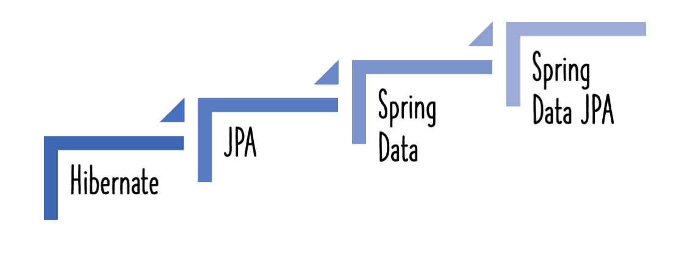
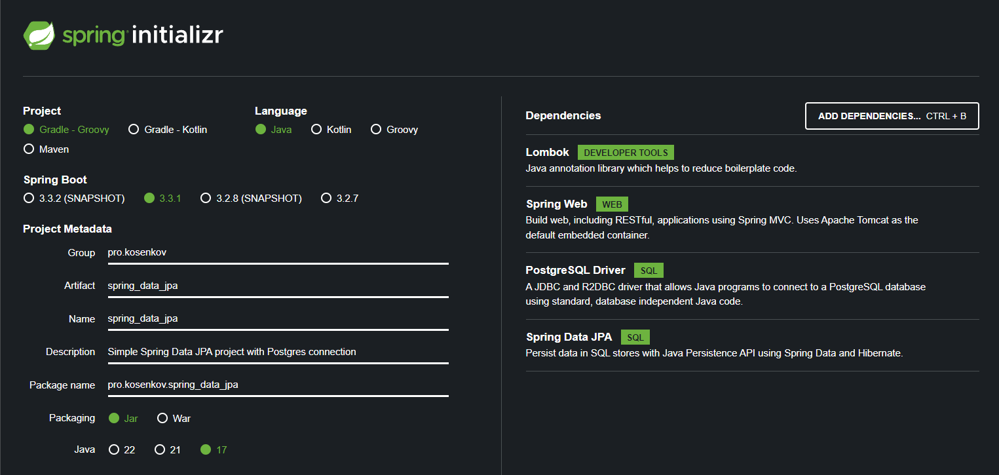

# JsonReader

Чтение json файла и формирование ответа контроллером

Разбирается 2 версии контроллеров: 

v1 - простая версия, подходит для учебных проектов

v2 - С дополнительными доработками указанными в комментариях в классах запросов и ответов подходит для серьезного проекта

# Назначение приложения
Приложение позволяет хранить и просматривать список
разрешений на хранение и ношение оружия (РОХа). У документа РОХа
есть дата выдачи и дата истичения, перед которой
владелец гражданского оружия обязан ее продлить.

Это темтовое приложение, которое показывает как подключить Spring Data JPA.
Поэтому тут не будет большого функционала и прочей логики. 

## Описание person.json

гладкоствольное оружие - smoothbore weapons

нарезное оружие - rifled weapons

травматическое оружие - traumatic weapons

холодное оружие - cold steel

# Описание используемых инструментов
## Библиотека Lombok

Библиотека нужна для автоматической генерации конструкторов, геттеров, сеттеров, методов toString, hashCode, equals и других
 с помощью аннотаций, работающих благодаря механизму рефлексии, т.е. встраивании в ваш код сгенерированного кода на этапе компиляции. 
Короче четеры сами сгенерируются для всех полей если будет стоять над классом аннотация `@Getter`

### Аннотация @Data

[@Data](https://projectlombok.org/features/Data) - это удобная сокращенная аннотация, которая объединяет функции `@toString,
@Equals и @hashCode, @Getter / @Setter и @RequiredArgsConstructor вместе: другими словами,
@Data генерирует все шаблоны, которые обычно ассоциируются с простыми POJO (обычными старыми объектами Java) и beans:
геттеры для всех полей, сеттеры настройки. для всех неокончательных полей и соответствующих реализаций toString,
equals и hashCode, которые включают поля класса, и конструктора, который инициализирует все конечные поля,
а также все неокончательные поля без инициализатора, помеченные символом @NonNull, чтобы гарантировать,
что это поле никогда не будет пустым.

## SpringDataJpa
Simple Spring Data JPA project with Postgres connection

### Почему именно Spring Data JPA?

Потому что на 2024 год это самая удобная для разработки технология!

[Теория - сайт ПК Зверь](https://pc-zver.ru/news/jpa/)

### Видео инструкция

### Настройки репозитория

[Spring Init](https://start.spring.io/#!type=gradle-project&language=java&platformVersion=3.3.1&packaging=jar&jvmVersion=17&groupId=pro.kosenkov&artifactId=spring_data_jpa&name=spring_data_jpa&description=Simple%20Spring%20Data%20JPA%20project%20with%20Postgres%20connection&packageName=pro.kosenkov.spring_data_jpa&dependencies=lombok,web,postgresql,data-jpa "Создает каркас этого приложения")

### Назначение приложения
Приложение позволяет хранить и просматривать список
разрешений на хранение и ношение оружия (РОХа). У документа РОХа
есть дата выдачи и дата истичения, перед которой
владелец гражданского оружия обязан ее продлить.

Это темтовое приложение, которое показывает как подключить Spring Data JPA.
Поэтому тут не будет большого функционала и прочей логики.

### Инструкция для запуска

1. Открыть проект в IDE
2. Скачать Gradle зависимости - файл build.gradle
3. Запустить SpringDataJpaApplication
4. Перейти по ссылке:
1) для загрузки тестовых данных: http://localhost:8080/api/v1/kit_start
2) для выгрузки из БД данных: http://localhost:8080/api/v1/weapons

### Подключение к ранее созданной бд

Выберите `ddl-auto: none` если ваша бд и таблица уже создана.

Если вы хотите чтобы таблица `weapon` была создана в другой БД, а не по умолчанию
в бд с именем `postgres` в схеме `public`, то создайте эту бд вручную, а затем в `application.yml` допишите её название
в `url`

Настройка `ddl-auto`:
1. validate: validate the schema, makes no changes to the database.
2. create-only: database creation will be generated.
3. drop: database dropping will be generated.
4. update: update the schema.
5. create: creates the schema, destroying previous data.
6. create-drop: drop the schema when the SessionFactory is closed explicitly, typically when the application is stopped.
7. none: does nothing with the schema, makes no changes to the database

# Полезные ссылки

1. [Генератор личностей](https://randus.org/)

2. Время указываем в секундах прошедших с 1го января 1970 года (Unix Timestamp)
[В этом поможе сайт unixtimestamp.com](https://www.unixtimestamp.com/)

# P.s.

Приложение не содержит конфеденсальной информации, любые совпадения случайны, поскольку информация об тестовых 
пользователях приложения была получена через [Генератор личностей](https://randus.org/) 
